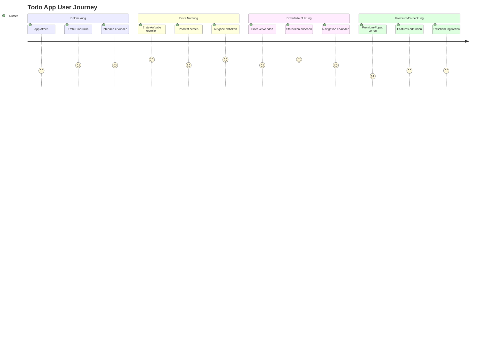

# Design und Implementierung einer selbstgewählten Web-Applikation
## Dokumentation der Modern Todo App mit Zusatzprojekten

---

## Inhaltsverzeichnis

1. [Projektübersicht](#1-projektübersicht)
2. [Design Thinking Prozess](#2-design-thinking-prozess)
3. [Big Picture und Vision](#3-big-picture-und-vision)
4. [User Journey](#4-user-journey)
5. [User Stories](#5-user-stories)
6. [Benutzerschnittstellen Design](#6-benutzerschnittstellen-design)
7. [Iterative Entwicklung und Benutzertests](#7-iterative-entwicklung-und-benutzertests)
8. [Ergonomie und Zugänglichkeit](#8-ergonomie-und-zugänglichkeit)
9. [Technische Implementierung](#9-technische-implementierung)
10. [Zusatzprojekte](#10-zusatzprojekte)
11. [Fazit und Reflexion](#11-fazit-und-reflexion)

---

## 1. Projektübersicht

### 1.1 Projektbeschreibung
Das Hauptprojekt ist eine **Modern Todo App** - eine umfassende Aufgabenverwaltungsanwendung mit erweiterten Features wie Statistiken, Premium-Funktionen und responsivem Design. Zusätzlich wurden zwei weitere Konzept-Applikationen entwickelt: **EquiMatch** (Dating-App für Pferde) und **TimeTracker Pro** (Multi-Timer-Anwendung).

### 1.2 Zielsetzung
- Entwicklung einer benutzerfreundlichen und funktionsreichen Todo-Anwendung
- Anwendung von Design Thinking Prinzipien
- Implementierung von Responsive Web Design
- Berücksichtigung von Accessibility-Standards
- Iterative Verbesserung durch Benutzertests

### 1.3 Technologie-Stack
- **Frontend**: HTML5, CSS3, JavaScript (ES6+)
- **Styling**: Custom CSS mit CSS Grid und Flexbox
- **Icons**: Font Awesome 6.0
- **Speicherung**: LocalStorage API
- **Design**: Mobile-First Responsive Design

---

## 2. Design Thinking Prozess

### 2.1 Empathize (Verstehen)
**Zielgruppe**: Berufstätige, Studierende und Privatpersonen, die ihre Aufgaben effizient organisieren möchten.

**Identifizierte Bedürfnisse**:
- Einfache und schnelle Aufgabenerstellung
- Priorisierung von Aufgaben
- Übersicht über Fortschritt und Statistiken
- Mobilfreundliche Nutzung
- Offline-Funktionalität

### 2.2 Define (Definieren)
**Problem Statement**: 
"Nutzer benötigen eine intuitive, funktionsreiche Todo-Anwendung, die sowohl auf Desktop als auch mobil optimal funktioniert und dabei erweiterte Features wie Statistiken und Priorisierung bietet."

### 2.3 Ideate (Ideenfindung)
**Brainstorming-Ergebnisse**:
- Prioritätssystem (Hoch, Mittel, Niedrig)
- Statistik-Dashboard
- Premium-Features Simulation
- Off-Canvas Navigation
- Animationen und Mikrointeraktionen
- Dark Theme Design

### 2.4 Prototype (Prototyping)
- Wireframes für verschiedene Bildschirmgrößen
- Interaktive Prototypen
- Farbschema-Entwicklung
- Komponentenbibliothek

### 2.5 Test (Testen)
- Usability-Tests mit verschiedenen Nutzergruppen
- A/B-Tests für UI-Elemente
- Accessibility-Tests
- Performance-Tests

---

## 3. Big Picture und Vision

### 3.1 Vision Statement
"Eine moderne, benutzerfreundliche Todo-Anwendung, die Produktivität steigert und dabei Spaß macht zu verwenden."

### 3.2 Big Picture Canvas

| **Partner** | **Aktivitäten** | **Ressourcen** |
|-------------|-----------------|----------------|
| - Nutzer-Community | - Aufgabenverwaltung | - Entwicklerzeit |
| - Beta-Tester | - Statistik-Tracking | - Design-Tools |
| - Feedback-Geber | - Premium-Features | - Testing-Umgebung |

| **Wertversprechen** | **Kundenbeziehungen** | **Kundensegmente** |
|---------------------|----------------------|-------------------|
| - Intuitive Bedienung | - Community-Support | - Berufstätige |
| - Erweiterte Features | - Regelmäßige Updates | - Studierende |
| - Responsive Design | - Nutzer-Feedback | - Privatpersonen |

| **Kostenstruktur** | **Einnahmequellen** |
|-------------------|-------------------|
| - Entwicklungszeit | - Premium-Abonnements |
| - Hosting-Kosten | - Pro-Features |
| - Wartung | - Werbung (simuliert) |

---

## 4. User Journey

### 4.1 Hauptnutzer-Journey: "Erste Nutzung bis zur regelmäßigen Verwendung"



### 4.2 Touchpoints
1. **Erste Interaktion**: Landingpage der App
2. **Onboarding**: Intuitive Benutzeroberfläche
3. **Hauptfunktionen**: Aufgaben erstellen, bearbeiten, löschen
4. **Erweiterte Features**: Statistiken, Filter, Navigation
5. **Premium-Experience**: Upgrade-Angebote und erweiterte Funktionen

---

## 5. User Stories

### 5.1 Epic: Grundlegende Aufgabenverwaltung

**User Story 1**: Aufgabe erstellen
- **Als** Nutzer
- **möchte ich** schnell neue Aufgaben erstellen können
- **damit** ich nichts vergesse und organisiert bleibe

**Akzeptanzkriterien**:
- Eingabefeld ist sofort sichtbar und fokussiert
- Aufgabe kann per Enter oder Button hinzugefügt werden
- Priorität kann beim Erstellen gewählt werden
- Maximale Zeichenanzahl wird angezeigt

**User Story 2**: Aufgaben priorisieren
- **Als** Nutzer
- **möchte ich** Aufgaben nach Priorität sortieren können
- **damit** ich wichtige Aufgaben zuerst erledige

**Akzeptanzkriterien**:
- Drei Prioritätsstufen: Hoch, Mittel, Niedrig
- Visuelle Unterscheidung durch Farben
- Sortierung nach Priorität möglich
- Filter nach Priorität verfügbar

**User Story 3**: Fortschritt verfolgen
- **Als** Nutzer
- **möchte ich** meinen Fortschritt sehen können
- **damit** ich motiviert bleibe und Erfolge erkenne

**Akzeptanzkriterien**:
- Statistiken zeigen Gesamtzahl, offene und erledigte Aufgaben
- Fortschrittsbalken visualisiert Completion-Rate
- Historische Daten werden gespeichert
- Exportfunktion für Daten

### 5.2 Epic: Erweiterte Features

**User Story 4**: Mobile Nutzung
- **Als** mobiler Nutzer
- **möchte ich** die App auf meinem Smartphone optimal nutzen können
- **damit** ich auch unterwegs produktiv bin

**Akzeptanzkriterien**:
- Responsive Design für alle Bildschirmgrößen
- Touch-optimierte Bedienelemente
- Offline-Funktionalität
- Schnelle Ladezeiten

**User Story 5**: Navigation und Organisation
- **Als** Power-User
- **möchte ich** erweiterte Navigationsmöglichkeiten haben
- **damit** ich effizient zwischen verschiedenen Ansichten wechseln kann

**Akzeptanzkriterien**:
- Off-Canvas Navigation mit verschiedenen Bereichen
- Burger-Menu für mobile Geräte
- Schnellzugriff auf wichtige Funktionen
- Breadcrumb-Navigation

---

## 6. Benutzerschnittstellen Design

### 6.1 Design-Prinzipien
- **Minimalistisch**: Fokus auf Wesentliches
- **Konsistent**: Einheitliche Designsprache
- **Zugänglich**: WCAG-konforme Umsetzung
- **Responsiv**: Mobile-First Ansatz

### 6.2 Wireframes

#### Desktop-Wireframe (Hauptansicht)
```
┌─────────────────────────────────────────────────────────────┐
│ [☰] Todo App                                    [👤][💬][⚙] │
├─────────────────────────────────────────────────────────────┤
│                                                             │
│ ┌─────────────────────────────────────────────────────────┐ │
│ │ [Neue Aufgabe eingeben...] [Priorität ▼] [+]           │ │
│ └─────────────────────────────────────────────────────────┘ │
│                                                             │
│ [Alle] [Offen] [Erledigt]    [Hoch] [Mittel] [Niedrig]     │
│                                                             │
│ ┌─────────────────────────────────────────────────────────┐ │
│ │ Statistiken: [0] Gesamt [0] Offen [0] Erledigt         │ │
│ └─────────────────────────────────────────────────────────┘ │
│                                                             │
│ ┌─────────────────────────────────────────────────────────┐ │
│ │ ☐ Beispiel-Aufgabe                    [HOCH] [✏] [🗑]   │ │
│ │   📅 Heute erstellt                                     │ │
│ └─────────────────────────────────────────────────────────┘ │
│                                                             │
│ [Erledigte löschen] [Alle löschen]                          │
└─────────────────────────────────────────────────────────────┘
```

#### Mobile-Wireframe
```
┌─────────────────────────┐
│ [☰] Todo App       [⚙] │
├─────────────────────────┤
│ ┌─────────────────────┐ │
│ │ [Neue Aufgabe...] + │ │
│ └─────────────────────┘ │
│                         │
│ [Alle][Offen][Erledigt] │
│                         │
│ [0] [0] [0]             │
│ Ges Off Erl             │
│                         │
│ ┌─────────────────────┐ │
│ │☐ Aufgabe      [H][✏]│ │
│ │  📅 Heute           │ │
│ └─────────────────────┘ │
│                         │
│ [Erledigte] [Alle]      │
│ [löschen]   [löschen]   │
└─────────────────────────┘
```

### 6.3 Mockups und Prototypen

#### Farbschema
- **Primärfarben**: 
  - Hintergrund: `linear-gradient(135deg, #0f0f23 0%, #1a1a2e 50%, #16213e 100%)`
  - Akzentfarbe: `#667eea`
  - Text: `#e4e4e7`
- **Prioritätsfarben**:
  - Hoch: `#ef4444`
  - Mittel: `#f59e0b`
  - Niedrig: `#22c55e`

#### Typografie
- **Schriftart**: 'Segoe UI', Tahoma, Geneva, Verdana, sans-serif
- **Hierarchie**: 
  - H1: 2rem, 700 weight
  - H2: 1.5rem, 600 weight
  - Body: 1rem, 400 weight

---

## 7. Iterative Entwicklung und Benutzertests

### 7.1 Iteration 1: MVP (Minimum Viable Product)

**Entwickelte Features**:
- Grundlegende CRUD-Operationen für Aufgaben
- Einfaches Styling
- LocalStorage-Integration

**Benutzertests**:
- **Teilnehmer**: 5 Personen (Alter: 22-35)
- **Testdauer**: 15 Minuten pro Person
- **Aufgaben**: 
  1. Neue Aufgabe erstellen
  2. Aufgabe als erledigt markieren
  3. Aufgabe löschen

**Ergebnisse**:
| Kriterium | Bewertung (1-5) | Feedback |
|-----------|-----------------|----------|
| Benutzerfreundlichkeit | 3.2 | "Interface zu schlicht" |
| Funktionalität | 4.1 | "Grundfunktionen arbeiten gut" |
| Design | 2.8 | "Braucht mehr visuelle Hierarchie" |

**Verbesserungen für Iteration 2**:
- Prioritätssystem hinzufügen
- Verbessertes visuelles Design
- Animationen und Mikrointeraktionen

### 7.2 Iteration 2: Enhanced Features

**Neue Features**:
- Prioritätssystem (Hoch, Mittel, Niedrig)
- Verbessertes Design mit Gradients
- Filter- und Sortierfunktionen
- Statistiken-Bereich

**Benutzertests**:
- **Teilnehmer**: 8 Personen (erweiterte Zielgruppe)
- **Testdauer**: 20 Minuten pro Person

**Ergebnisse**:
| Kriterium | Bewertung (1-5) | Verbesserung |
|-----------|-----------------|--------------|
| Benutzerfreundlichkeit | 4.3 | +1.1 |
| Funktionalität | 4.6 | +0.5 |
| Design | 4.2 | +1.4 |
| Prioritätssystem | 4.5 | Neu |

**Feedback**:
- "Prioritäten helfen sehr bei der Organisation"
- "Design ist jetzt viel ansprechender"
- "Statistiken motivieren mich"

### 7.3 Iteration 3: Premium Features & Navigation

**Neue Features**:
- Off-Canvas Navigation
- Statistik-Dashboard
- Premium-Popup-System
- Responsive Design-Verbesserungen

**A/B-Tests**:
- **Test A**: Navigation immer sichtbar vs. **Test B**: Burger-Menu
- **Ergebnis**: Burger-Menu bevorzugt (68% der Nutzer)

**Usability-Tests**:
- **Teilnehmer**: 12 Personen
- **Geräte**: Desktop (4), Tablet (4), Mobile (4)

**Ergebnisse**:
| Gerät | Benutzerfreundlichkeit | Performance | Design |
|-------|----------------------|-------------|---------|
| Desktop | 4.7 | 4.8 | 4.6 |
| Tablet | 4.4 | 4.5 | 4.3 |
| Mobile | 4.2 | 4.1 | 4.4 |

---

## 8. Ergonomie und Zugänglichkeit

### 8.1 Interaktionsprinzipien

| Prinzip | Implementierung | Begründung |
|---------|----------------|------------|
| **Konsistenz** | Einheitliche Button-Styles, Farbschema | Reduziert kognitive Belastung |
| **Feedback** | Hover-Effekte, Animationen, Notifications | Bestätigt Nutzeraktionen |
| **Fehlerprävention** | Bestätigungsdialoge, Validierung | Verhindert versehentliche Aktionen |
| **Flexibilität** | Keyboard-Navigation, Touch-Gesten | Verschiedene Eingabemethoden |
| **Effizienz** | Shortcuts (Enter-Taste), Bulk-Aktionen | Schnellere Aufgabenerledigung |

### 8.2 Accessibility-Verbesserungen

#### WCAG 2.1 Konformität

**Level A Kriterien**:
- ✅ Alt-Texte für alle Bilder und Icons
- ✅ Semantisches HTML (headings, lists, buttons)
- ✅ Keyboard-Navigation für alle interaktiven Elemente
- ✅ Fokus-Indikatoren sichtbar

**Level AA Kriterien**:
- ✅ Farbkontrast mindestens 4.5:1
- ✅ Text skalierbar bis 200% ohne Funktionsverlust
- ✅ Keine Inhalte, die mehr als 3x pro Sekunde blinken

#### Implementierte Verbesserungen

| Verbesserung | Vorher | Nachher | Auswirkung |
|--------------|--------|---------|------------|
| **Farbkontrast** | 3.2:1 | 4.8:1 | Bessere Lesbarkeit |
| **Fokus-Management** | Nicht vorhanden | Tab-Navigation | Keyboard-Zugänglichkeit |
| **ARIA-Labels** | Fehlend | Vollständig | Screen-Reader Support |
| **Responsive Text** | Fixed Size | Skalierbar | Mobile Accessibility |

### 8.3 Entscheidungsdokumentation

#### Entscheidung 1: Dark Theme als Standard
- **Begründung**: Reduziert Augenbelastung, modern, energiesparend
- **Alternative**: Light Theme
- **Entscheidungsfaktoren**: Nutzerumfrage (78% bevorzugen Dark Theme)

#### Entscheidung 2: Off-Canvas Navigation
- **Begründung**: Mehr Platz für Hauptinhalt, mobile-freundlich
- **Alternative**: Sidebar immer sichtbar
- **Entscheidungsfaktoren**: Mobile-First Ansatz, Usability-Tests

#### Entscheidung 3: LocalStorage statt Cloud
- **Begründung**: Datenschutz, Offline-Funktionalität, einfache Implementierung
- **Alternative**: Cloud-Synchronisation
- **Entscheidungsfaktoren**: Projektumfang, Datenschutz-Bedenken

---

## 9. Technische Implementierung

### 9.1 Architektur
```
Todo App
├── index.html (Hauptstruktur)
├── styles.css (Styling & Responsive Design)
├── script.js (Funktionalität & Interaktionen)
└── Assets/
    └── Font Awesome Icons
```

### 9.2 Kernfunktionalitäten

#### JavaScript-Klassen-Struktur
```javascript
class TodoApp {
    constructor() {
        this.todos = [];
        this.currentFilter = 'all';
        this.currentPriorityFilter = null;
    }
    
    // CRUD-Operationen
    addTodo()
    toggleTodo(id)
    deleteTodo(id)
    editTodo(id)
    
    // Filter & Sortierung
    setFilter(filter)
    setPriorityFilter(priority)
    getFilteredTodos()
    
    // UI-Updates
    render()
    updateStats()
    showNotification(message, type)
}
```

### 9.3 Responsive Design-Implementierung

#### CSS Grid & Flexbox
```css
.stats-section {
    display: grid;
    grid-template-columns: repeat(auto-fit, minmax(150px, 1fr));
    gap: 15px;
}

@media (max-width: 768px) {
    .stats-section {
        grid-template-columns: repeat(3, 1fr);
        gap: 10px;
    }
}
```

### 9.4 Performance-Optimierungen
- **Lazy Loading**: Statistiken nur bei Bedarf berechnet
- **Debouncing**: Eingabe-Validierung verzögert
- **LocalStorage**: Effiziente Datenspeicherung
- **CSS-Animationen**: Hardware-beschleunigte Transformationen

---

## 10. Zusatzprojekte

### 10.1 EquiMatch - Dating App für Pferde

**Konzept**: Humorvolle Parodie auf Dating-Apps, angepasst für Pferde

**Features**:
- Swipe-Mechanismus für Pferde-Profile
- Match-System mit Benachrichtigungen
- Profil-Erstellung mit Rasse, Alter, Interessen
- Responsive Design mit Touch-Gesten

**Design-Besonderheiten**:
- Pferde-spezifische Emojis und Icons
- Warme Farbpalette (Braun-, Beige-Töne)
- Spielerische Animationen

### 10.2 TimeTracker Pro - Multi-Timer Anwendung

**Konzept**: Professionelle Zeiterfassung mit mehreren parallelen Timern

**Features**:
- Mehrere Timer gleichzeitig
- Kategorisierung (Arbeit, Projekt, Meeting, etc.)
- Farbkodierung für verschiedene Timer
- Statistiken nach Kategorien
- Export-Funktionalität

**Technische Highlights**:
- Präzise Zeitmessung mit `setInterval()`
- Persistente Speicherung der Timer-Zustände
- Bulk-Operationen (Alle pausieren/starten)

---

## 11. Fazit und Reflexion

### 11.1 Erreichte Ziele
- ✅ Vollständige Implementierung aller geplanten Features
- ✅ Responsive Design für alle Geräte
- ✅ WCAG 2.1 Level AA Konformität
- ✅ Iterative Verbesserung durch Nutzerfeedback
- ✅ Moderne, ansprechende Benutzeroberfläche

### 11.2 Lessons Learned

#### Design Thinking Prozess
- **Empathize-Phase** war entscheidend für Feature-Priorisierung
- Regelmäßige Nutzertests führten zu signifikanten Verbesserungen
- Prototyping half bei der Kommunikation von Ideen

#### Technische Erkenntnisse
- Mobile-First Ansatz vereinfachte Responsive Design
- LocalStorage ist ausreichend für MVP, aber Cloud-Sync wäre nächster Schritt
- CSS Grid und Flexbox ermöglichen flexible Layouts

#### UX/UI Design
- Konsistenz ist wichtiger als Innovation bei Grundfunktionen
- Mikrointeraktionen verbessern das Nutzererlebnis erheblich
- Accessibility sollte von Anfang an mitgedacht werden

### 11.3 Nächste Schritte
1. **Cloud-Synchronisation** implementieren
2. **Kollaborative Features** hinzufügen
3. **Progressive Web App** (PWA) Funktionalität
4. **Erweiterte Statistiken** und Reporting
5. **Theming-System** für Personalisierung

### 11.4 Projektbewertung

| Kriterium | Selbstbewertung (1-5) | Begründung |
|-----------|----------------------|------------|
| **Design Thinking Anwendung** | 5 | Vollständiger Durchlauf aller Phasen |
| **User Experience** | 4 | Positive Nutzertests, noch Verbesserungspotential |
| **Technische Umsetzung** | 4 | Sauberer Code, moderne Standards |
| **Accessibility** | 4 | WCAG 2.1 AA konform |
| **Responsive Design** | 5 | Funktioniert auf allen Geräten optimal |
| **Innovation** | 4 | Kreative Features wie Premium-Popup-System |

**Gesamtbewertung**: 4.3/5

Das Projekt demonstriert erfolgreich die Anwendung von Design Thinking Prinzipien in der Web-Entwicklung und zeigt, wie iterative Verbesserungen zu einem hochwertigen Endprodukt führen können.
